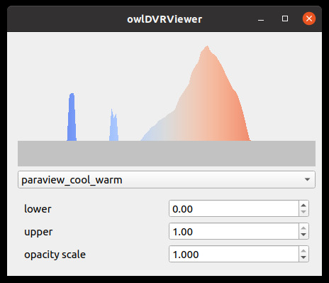
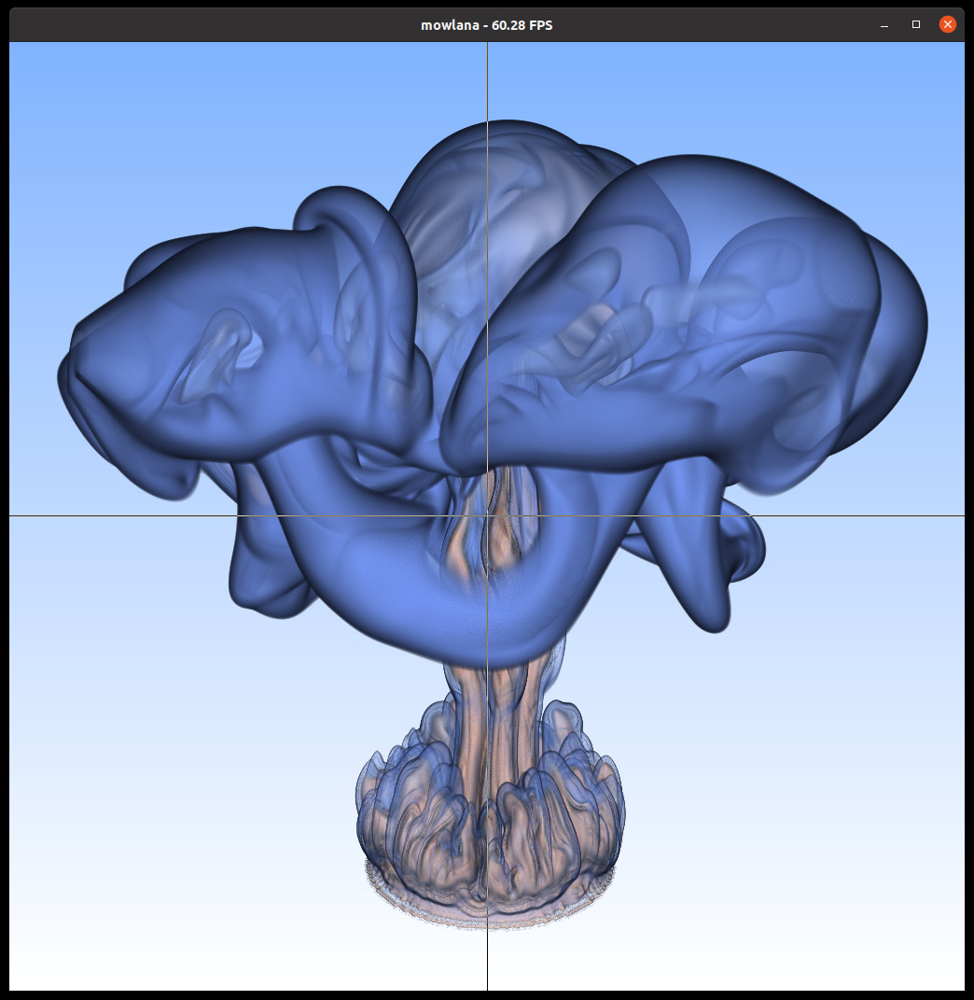

# Cutey-OWL - QT5 Based 3D Viewer and Transfer Function Editor Widgets

This repo/library provides two QT5 Widgets to help users build (not
necessarily OWL based) QT Enabled 3D Model Viewers.

In particular, we currently provide two widgets:

- **qtOWL/OWLViewer** : A base widget for a 3D viewer that manages
mouse and keyboard inputs to modify a 3D camera pose - all the user
has to do is override some virtual functions for `render()`,
`cameraChanged()`, etc.

- **qtOWL/XFEditor** : A QT Transfer function editor widget that
allows for modifying a alpha color map via mouse dragging and/or
predefined color maps.

Here two screnshots of what these widgets look like, first the
transfer function editor:

.... and second, a sample direct volume renderer (`owlDVR`)
that is derived from the `qtOWL::OWLViewer` widget (the actual rendering
happens in `owlDVR`, `qtOWL::OWLViewer` only handles the 3D camera
and frame buffer):

## Relation to / Dependence on OWL

This project was built primarily to facilitate the easier generation
of different 3D model/volume viewers for the OWL Project
(http://github.com/owl-project/owl); as such, the widgets currently do
(still) use some OWL classes for 3D math (eg, `owl::common::vec3f`),
and consequently assumes to be used in conjunction with OWL. 

However, the widgets themselves would now actually need OWL, and
*could* be rewritten completely with QT point/vector classes. This has
however not yet been done.

## Dependencies

- cuteeOWL currently assumes that OWL has already been included in the
  main project before `add_subdirectory(cuteeOWL)` is being
  called. THis dependency can/may at some point get removed (see note
  on "Relation to OWL" above)

- cuteeOWL uses QT5. On Ubuntu 20, this can be installed with, for example,

	apt install qtbase5-dev

## Using `cuteeOWL` in a User Project

To use cuteeOWL in your own project, the (strongly) recommended way is
to use as a CMake submodule. To do so: in your `CMakeLists.txt` file,
first add owl, then add cuteeOWL:

	add_subdirectory(<pathToSubmodules>/owl EXCLUDE_FROM_ALL)
	add_subdirectory(<pathToSubmodules>/cuteeOWL EXCLUDE_FROM_ALL)

(see note on OWL dependency above). We recommend using the
`EXCLUDE_FROM_ALL` flag for the `add_subdirectory` calls,
so only the required parts of these libraries gets called.

After including these directory, you can use some cuteeOWL-supplied
cmake variables to properly set your own tagets' dependencies,
include-flags, cxx flags, etc.

	add_definitions(${QT_OWL_CXX_FLAGS})
	include_directories(${QT_OWL_INCLUDES})
	...
	target_link_libraries(<userTarget> .. ${QT_OWL_LIBRARIES})
  
In your own code, transfer function editor and 3d Viewer widget can be
used either independently, or together.

## Using the Transfer Function Editor Widget

To use the transfer function editor, simply include `qtOWL/XFEditor`,
then create an instance of the `qtOWL::XFEditor` widget, use it in
your own qt app, and connect the proper signals that let your app know
when the color map or other transfer function parameters have been
changed. The XFEditor comes with a predefined (embedded) set of
default color maps, and also has functions to return the current color
map, to load or save color maps, etc.

## Using the OWLViewer 3D Viewer Widget

The OWLViewer base class takes care of taking mouse motion and
keyboard commands to control a 3d "Camera" coordinate frame; allowing
both a "fly" mode (in which the viewer rotates around himself, similar
to motion in a 3D shooter application), or an "inspect" mode (in which
the cmaera rotates around a (changeable) point of interest). 

The base class handles both the device-side frame buffer
(automatically creating and resizing texture memory, mapping that
texture memory, etc), as well as all camera modifications via mouse
motion or keyboard presses; the user code can then intercept any
changes to the camera, and describes how a frame gets rendered.

### Building your own 3D Viewer

The OWLViewer base class does handle frame buffer and mouse motion,
but by itself will not do any rendering: the `render()` method is
virtual, and has to first be overridden with the user's own render
code to make this do anythyihng,.

For building your own 3D Viewer, you subclass the `qtOWL::OWLViewer`
class, then override this base class'es virtual `render()`,
`cameraChanged()`, and possibly `resize()` methods.

In your overridden `render()` method, you have access to the two
(inherited) members of `vec2i fbSize` and `uint32_t *fbPointer`: the
first of those gives the number of pixels the method is supposed to
render; the latter points to a (GPU) device memory region where the
pixels are supposed to be written to on the GPU. Note the fbPointer is
valid only on the device (it is mapped to a CUDA texture for faster
display), so should only be written to in OptiX or CUDA code (or via
`cudaMemcpy` from the code, if you really want to render on the host).

In the overriden `cameraChanged()`, you can ask the parent class for
the latest 3D camera settings (that all get managed by the base class).

In `resize()` you can intercept any resize events. Resizing the main
CUDA texture frame buffer is already handled by the parent class, as
is the setting of the proper aspect ratio in the camera; so for many
applications this method does not have to be overridden at
all. However, it can be useful to override this method if the user
code wants to, for example, manage an additional accumulation buffer,
depth buffer, etc.

## Initializing Camera Manipulators

As mentioned above the base OWLViewer automatically controls the
camera, but different applications need different ways of doing so.
To enabel that OWLViewer supports two (and eventually, possibly more)
*different* ways of controlling the camera. Currently, OWLViewer
supports two modes: 

`inspect mode`: The camera rotates around a 3D "point of interest"
(POI) (usually the center of a 3D model). The 3D point of interest can
be changed, but any rotation via left button will rotate the camera
around the POI, not the other way around. This mode can further me
configured to either do a "ArcBall" like rotation, or one with a fixed
"viewUp" vector.

`fly mode`: The camera by default rotates around the camera origin.

### Enabling Inspect Mode

To allow inspect mode, you have to explicity call `enabelFlyMode` 
as follows

	MyOWLViewerClass viewer(...);
	...
	viewer.enableInspectMode(worldBounds, 
	                         minDistance, 
	                         maxDistance);

In this call, `worldBounds` is the bounding box bounding the 3D model
to be inspected; the point of interest will be set to the center of
this box. In addtion, `minDistance` and `maxDistance` specify some
bounds that will restrict how far the camera origin may be away from
the POI. All three values ahve default parametesr, and can thus be
omitted.

### Enabling Fly Mode

To enable fly mode, simply once call `enableFlyMode()`

	MyOWLViewerClass viewer(...);
	...
	viewer.enableFlyMode();

### Selecting which Camera/Inspect mode is active

By default, the order in which the different modes get activated
specifies which one is active (the last one being activated). Once
modes are enables, they can also be changed any time by calling either

	viewer.cameraManipulator = viewer.inspectMode;
	
or

	viewer.cameraManipulator = viewer.flyMode;

The `OWLViewer` class will, by default, also allow to switch this via
keyboard commands, using `F` (capital f) to switch to fly mode, and
'I' (capital i) to switch to inspect mode. Pressing 'I' or 'F' will
only have an effect if the respective mode has been enabled first (see
above).,

### Setting the World Scale Hint

In order for the camera manipulators to know how far any given mouse
motion should translate the mouse in 3D world space, it does need to 
have some idea of how big that world is. To do this, use the `setWorldScale()` method:

	MyOWLViewerClass viewer(...);
	...
	viewer.setWorldScale(.1f*length(modelBounds.span()))

Usually, one tenth of the length of the world diagonal is a good
value; but you anything else if you so prefer. Unless overridden, the
`OWLViewer` base class will also allow for interactively changing this
value via they keyboard's '+' and '-' keys, which will increase resp
decrease the current world scale / motion speed value by a factor 1.5x
on each key press.

### How to use the Mouse to Control the Camera Pose

To control the camera pose, the viewer user can 'drag' the mouse,
with differnet mouse button presses having different effects:

- `left button` : will *rotate* the mouse, either around the POI
(inspect mode), or around the camera origin (fly mode)

- `right button: will *move* forward/backwards

- `middle button` wil *strafe* left/right/top/center. In inspect mode,
  this will also change the POI.
  
### Common keystrokes

While the user code can obviously override and change all this
functionality, the base class does provide several common
functionality that has been found useful for several differnt
projects, and thus has been added by default.

- `F` : switch to fly mode (if fly mode has been enabled, see above)

- `I` : switch to inspect mode (if fly mode has been enabled, see above)

- `+` : increase camera world-space motion speed (but *not* rotation speed) by 1.5x

- `-` : reduce camera world-space motion speed (but *not* rotation speed) by 1.5x 

- `C` : print current camera position on the console (useful if the user 
app can later parse this on the command line)

- 'x'/'X': set world 'up vector' to positive/negative x axis

- 'y'/'Y': set world 'up vector' to positive/negative t axis

- 'z'/'Z': set world 'up vector' to positive/negative z axis

- '!' (currently disabled) Save a screenshot

- `wasd`: WASD control of the camera, similar to left button.

		
